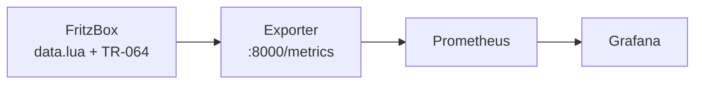
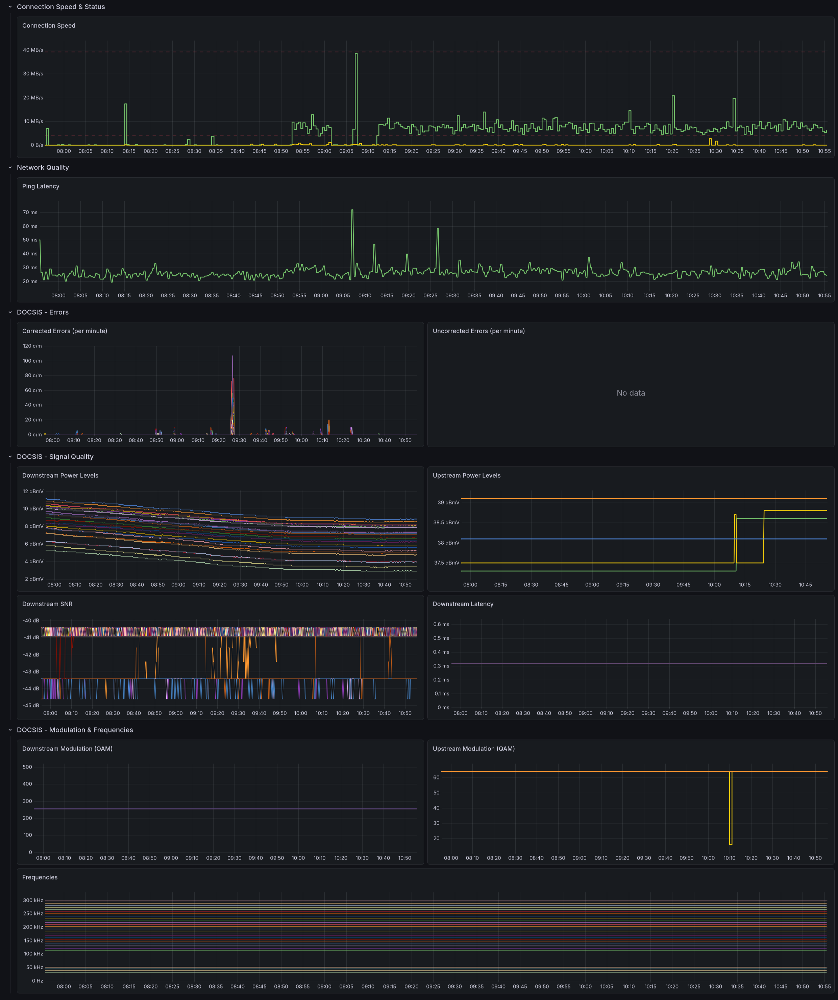

# FritzBox Cable Monitoring

[](https://github.com/fabianwimberger/fritzbox-monitoring/actions)
[](https://opensource.org/licenses/MIT)

> **⚠️ Disclaimer**: This is an independent, community-created project. It is **not affiliated with, endorsed by, or sponsored by AVM GmbH**. "AVM", "FRITZ!Box", and associated logos are trademarks of AVM GmbH. Use of these names is solely for identification and compatibility purposes. Use at your own risk.

A Prometheus exporter for AVM FritzBox cable modems. Collects DOCSIS signal quality metrics, connection speeds, and ping latency.

## Background

AVM's web UI shows live DOCSIS values but keeps no history, which makes tracking down intermittent cable issues painful. The FritzBox exposes the same data via its internal endpoints. This exporter scrapes them, serves Prometheus metrics, and ships a Grafana dashboard so signal quality, speeds, and error counters stay visible over time.

## Pipeline



## Features

- **DOCSIS signal metrics** — upstream/downstream power levels, SNR, modulation (QAM), frequencies, latency
- **Error tracking** — corrected and uncorrected downstream error counters, persisted across restarts
- **Connection speeds** — real-time upload/download speeds and max link rates via TR-064
- **Ping monitoring** — RTT measurements to a configurable target
- **Grafana dashboard** — ready-to-import dashboard included
- **Docker** — lightweight Alpine-based image

## Quick Start

### 1. Clone the repository

```bash
git clone https://github.com/fabianwimberger/fritzbox-monitoring.git
cd fritzbox-monitoring
```

### 2. Configure environment variables

```bash
cp .env.example .env
# Edit .env with your FritzBox credentials
```

### 3. Run with Docker Compose

```bash
docker compose up -d
```

The exporter will be available on `http://localhost:8000/metrics`.

## Configuration

All configuration is done via environment variables:

| Variable | Default | Description |
|----------|---------|-------------|
| `FRITZBOX_IP` | `192.168.178.1` | IP address of your FritzBox |
| `FRITZBOX_USER` | *(required)* | FritzBox username |
| `FRITZBOX_PASSWORD` | *(required)* | FritzBox password |
| `PING_TARGET` | `1.1.1.1` | Host to ping for latency measurement |
| `PORT` | `8000` | Exporter HTTP port |
| `STATE_FILE` | `/app/data/fritzbox_exporter_state.json` | Path to error-counter state file |
| `LAN_HOST_INTERVAL_SECONDS` | `180` | Minimum time between LAN host refreshes |

## Metrics

### DOCSIS Upstream

| Metric | Labels | Description |
|--------|--------|-------------|
| `fritzbox_docsis_upstream_power_level_dbmv` | `channel_id` | Upstream power level (dBmV) |
| `fritzbox_docsis_upstream_frequency_hz` | `channel_id` | Upstream frequency (Hz) |
| `fritzbox_docsis_upstream_modulation_qam` | `channel_id` | Upstream modulation (QAM) |
| `fritzbox_docsis_upstream_multiplex_info` | `channel_id`, `multiplex` | Multiplex method (ATDMA/SCDMA/TDMA) |

### DOCSIS Downstream

| Metric | Labels | Description |
|--------|--------|-------------|
| `fritzbox_docsis_downstream_power_level_dbmv` | `channel_id` | Downstream power level (dBmV) |
| `fritzbox_docsis_downstream_frequency_hz` | `channel_id` | Downstream frequency (Hz) |
| `fritzbox_docsis_downstream_modulation_qam` | `channel_id` | Downstream modulation (QAM) |
| `fritzbox_docsis_downstream_snr_db` | `channel_id` | Signal-to-noise ratio (dB) |
| `fritzbox_docsis_downstream_latency_ms` | `channel_id` | Downstream latency (ms) |
| `fritzbox_docsis_downstream_corrected_errors_total` | `channel_id` | Corrected errors (Counter) |
| `fritzbox_docsis_downstream_uncorrected_errors_total` | `channel_id` | Uncorrected errors (Counter) |
| `fritzbox_up` | none | `1` when the last FritzBox DOCSIS scrape succeeded |
| `fritzbox_scrape_duration_seconds` | none | Duration of the last FritzBox scrape |

### Connection Speeds

| Metric | Description |
|--------|-------------|
| `fritzbox_connection_upload_speed_bps` | Current upload speed (bps) |
| `fritzbox_connection_download_speed_bps` | Current download speed (bps) |
| `fritzbox_connection_upload_max_bps` | Max upload link rate (bps) |
| `fritzbox_connection_download_max_bps` | Max download link rate (bps) |

### Ping

| Metric | Labels | Description |
|--------|--------|-------------|
| `fritzbox_ping_rtt_avg_ms` | `target` | Average RTT (ms) |
| `fritzbox_ping_rtt_min_ms` | `target` | Min RTT (ms) |
| `fritzbox_ping_rtt_max_ms` | `target` | Max RTT (ms) |

### LAN Hosts

| Metric | Labels | Description |
|--------|--------|-------------|
| `fritzbox_lan_host` | `mac` | `1` when the FritzBox reports the host as active, otherwise `0` |

## Grafana Dashboard

<p align="center">
  
  <br><em>FritzBox Cable Monitoring dashboard in Grafana</em>
</p>

Import `grafana-dashboard.json` into your Grafana instance. The dashboard includes panels for:

- Connection speed (current vs max)
- Ping latency
- Corrected/uncorrected error rates
- Downstream/upstream power levels
- SNR and latency per channel
- Modulation and frequencies

## Manual Installation

If you prefer not to use Docker:

```bash
# Create virtual environment
python -m venv venv
source venv/bin/activate

# Install dependencies
pip install -r requirements.txt

# Run exporter
python exporter.py
```

## Prometheus Configuration

Add this job to your `prometheus.yml`:

```yaml
scrape_configs:
  - job_name: 'fritzbox'
    static_configs:
      - targets: ['localhost:8000']
    scrape_interval: 30s
```

## Requirements

- AVM FritzBox with DOCSIS cable connection
- FritzBox user account (not necessarily admin, but needs access to cable info)
- Docker & Docker Compose (recommended) or Python 3.9+
- Prometheus (to scrape the exporter)
- Grafana (optional, for the included dashboard)

## Troubleshooting

### Authentication failures

- Verify the username exists in the FritzBox UI under *System > FRITZ!Box Users*
- Ensure the user has permission to access cable information
- Check that `FRITZBOX_IP` is reachable from the host running the exporter

### No DOCSIS metrics

- Confirm your FritzBox model supports DOCSIS (cable models, not DSL/fiber)
- The exporter auto-detects DOCSIS 3.0 vs 3.1 channel data

### Ping failures in Docker

The Docker image includes `iputils` for ping support. If running manually, ensure `ping` is available on your system.

## License

[MIT](LICENSE)
